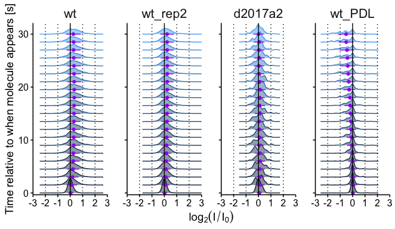
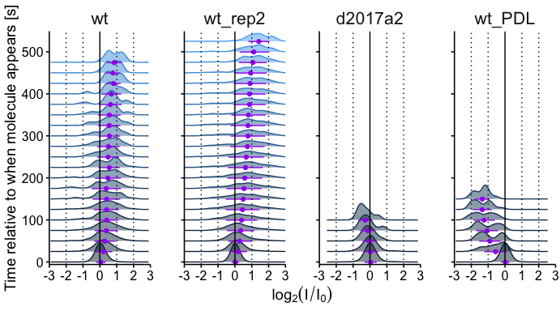
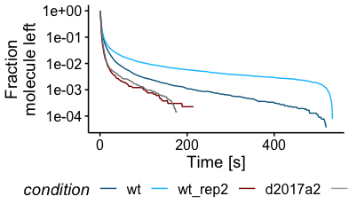
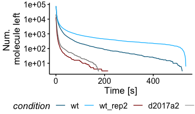
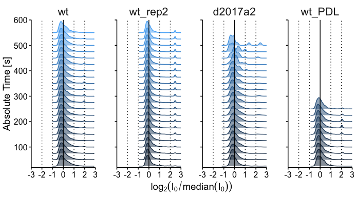
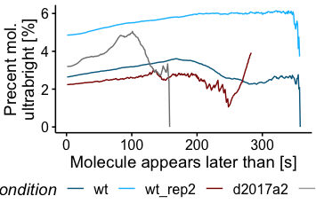
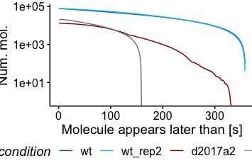
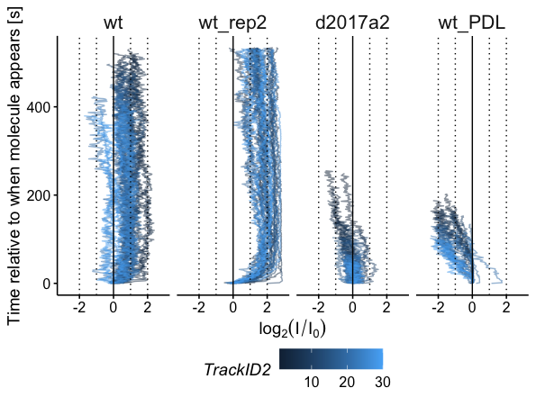

Analysis of Rab10-LRKK2 TIRF
================
CL, HD, AA
2022-06-18

# Load data

Load data

``` r
tirf_data_files <- list(wt = 'rab10rgnew_tracks.csv', wt_PDL = 'pdlrg_tracks.csv' ,d2017a2='d2017a2_tracks.csv', wt_rep2 = 'WT_tracks.csv')

tirf_data <- load_tracks(lapply(tirf_data_files, function(x) here('data-raw',x) )) %>%
  mutate(condition = factor(condition, levels = c("wt","wt_rep2","d2017a2", "wt_PDL")))
```

Make summary data

``` r
d50 <- summarize_tracks(tirf_data, w_avg=50, delta_frame_t=0.5, nskip=0, navg=1)
```

    ## `summarise()` has grouped output by 'condition', 'TrackID2'. You can override
    ## using the `.groups` argument.
    ## `summarise()` has grouped output by 'condition'. You can override using the
    ## `.groups` argument.

``` r
d50 %>% head(n=1000) %>% relocate(FrameGroupInt, t0, t0_true)
```

    ## # A tibble: 1,000 × 21
    ##    FrameGroupInt    t0 t0_true condition TrackID2 FrameGroup    A0 Sigma_median
    ##            <dbl> <dbl>   <dbl> <fct>        <int> <fct>      <dbl>        <dbl>
    ##  1             0    25     4.5 wt               1 [0,50)     4756.         1.84
    ##  2            25    25     4.5 wt               1 [50,100)   4756.         2.01
    ##  3            50    25     4.5 wt               1 [100,150)  4756.         2.09
    ##  4            75    25     4.5 wt               1 [150,200)  4756.         2.09
    ##  5           100    25     4.5 wt               1 [200,250)  4756.         2.21
    ##  6           125    25     4.5 wt               1 [250,300)  4756.         2.04
    ##  7           150    25     4.5 wt               1 [300,350)  4756.         2.06
    ##  8           175    25     4.5 wt               1 [350,400)  4756.         2.16
    ##  9           200    25     4.5 wt               1 [400,450)  4756.         2.16
    ## 10           225    25     4.5 wt               1 [450,500)  4756.         2.04
    ## # … with 990 more rows, and 13 more variables: SigmaNorm_median <dbl>,
    ## #   A_max <dbl>, A_mean <dbl>, Anorm_max <dbl>, Anorm_mean <dbl>,
    ## #   Anorm_median <dbl>, Frame0 <dbl>, delta_Anorm <dbl>,
    ## #   delta_Anorm_median <dbl>, FrameGroupIntMax <dbl>, AinitNorm <dbl>,
    ## #   Ainit0Norm <dbl>, ntracks_left <int>

``` r
d3 <- summarize_tracks(tirf_data, w_avg=3, delta_frame_t=0.5, nskip=0, navg=1)
```

    ## `summarise()` has grouped output by 'condition', 'TrackID2'. You can override
    ## using the `.groups` argument.
    ## `summarise()` has grouped output by 'condition'. You can override using the
    ## `.groups` argument.

# Evolution of intensity over time

``` r
plot_evolution<- function(data, tmax=Inf, tmin=0, lims = c(-2,2), jittered_points=F,eboffset=0.5, bandwidth=NULL, lab_ntracks=F){
  
  # tmax2 = 0 # only keep track that go to tmax2 at least
  # if (tmax_strict==T){
  #   tmax2 = tmax
  # }
  # height=stat(density)
  data_filtered <- 
     data %>%
  group_by(condition, TrackID2) %>%
  mutate(FrameGroupIntMax=max(FrameGroupInt)) %>%
  ungroup() %>%
  dplyr::filter(FrameGroupInt<=tmax, FrameGroupIntMax>=tmin)  #only keep tracks that go to tmax2, don't display distrib post tmax
  
  
  data_stats <- data_filtered  %>% 
    group_by(condition, FrameGroupInt) %>% 
    summarize(ntracks = n(), m = mean(ydata, na.rm=T),s=sd(ydata, na.rm=T)) %>% 
    ungroup() %>% 
    arrange(condition, FrameGroupInt) %>%
    dplyr::filter(ntracks>2)
 
  p<- data_filtered %>% 
    ggplot(aes( y=FrameGroupInt))+
  geom_density_ridges(aes(x=ydata, color=FrameGroupInt, group=FrameGroupInt, fill=FrameGroupInt), alpha=0.5, jittered_points = jittered_points, point_size=1, bandwidth=bandwidth)+
  geom_point(aes(y=FrameGroupInt-eboffset, x=m), data = data_stats, color='purple', fill='purple', size=1.5)+
  
    geom_errorbarh(aes(y=FrameGroupInt-eboffset, xmin=m-s, xmax=m+s), data = data_stats, color='purple', fill='purple',  width=.05, height=0.05, position=position_dodge(0.05))+
  geom_vline(xintercept=0, color='black', linetype='solid')+
  geom_vline(xintercept = 1, linetype='dotted')+
  geom_vline(xintercept = 2, linetype='dotted')+
  geom_vline(xintercept = -1, linetype='dotted')+
    geom_vline(xintercept = -2, linetype='dotted')
  
   if(lab_ntracks==T){
     p<- p+ geom_text(aes(x=-3, y=FrameGroupInt, label = ntracks),  data = data_stats, hjust="left", vjust="bottom", size=10/.pt)
   }
  
   
 
  p<- p + theme_publish()+
     lemon::facet_rep_wrap(~condition, ncol=4)+
  labs(x=bquote(log[2](I/I[0])),
                                        y="Time relative to when molecule appears [s]")+
                        guides(fill="none", color="none")+
    scale_x_continuous(limits= lims, expand = c(0,0))+
    scale_y_continuous(expand = c(0.01,0))
  
 

  out <- list(p=p, data_stats=data_stats, data_filtered=data_filtered)
  return(out)
}
```

``` r
plot_evolution(d3 %>% mutate(ydata = log2(Anorm_mean)), tmax=30, tmin=30, jittered_points=F, lims = c(-3,3), eboffset=0, bandwidth=0.1, lab_ntracks=F) -> evolution3
```

    ## `summarise()` has grouped output by 'condition'. You can override using the
    ## `.groups` argument.

    ## Warning: Ignoring unknown parameters: fill, width

``` r
p_fixed <- prettysave(evolution3$p, here('figures/ridgeplot_intensity_evolution_bin3_30s.pdf'),  panel.width = 1.3, panel.height =3)
```

    ## Warning: position_dodge requires non-overlapping x intervals

    ## Warning: position_dodge requires non-overlapping x intervals
    ## position_dodge requires non-overlapping x intervals
    ## position_dodge requires non-overlapping x intervals

    ## [1] "fig.width=6.9, fig.height=4"

``` r
plot_grid(p_fixed)
```

<!-- -->

``` r
evolution3$data_stats %>%
  group_by(condition) %>%
  slice_head(n=1) %>%
  dplyr::select(condition, ntracks) %>%
  ungroup()
```

    ## # A tibble: 4 × 2
    ##   condition ntracks
    ##   <fct>       <int>
    ## 1 wt           1171
    ## 2 wt_rep2      2334
    ## 3 d2017a2        50
    ## 4 wt_PDL        106

``` r
plot_evolution(d50 %>% mutate(ydata = log2(Anorm_mean)) %>%
                 dplyr::filter(log2(Ainit0Norm)<1000, ntracks_left>=10), tmax=Inf, tmin=0, jittered_points=F, lims = c(-3,3), bandwidth=0.2, lab_ntracks = F) -> evolution50
```

    ## `summarise()` has grouped output by 'condition'. You can override using the
    ## `.groups` argument.

    ## Warning: Ignoring unknown parameters: fill, width

``` r
p_fixed <- prettysave(evolution50$p, here('figures/ridgeplot_intensity_evolution_bin50_fullTraces.pdf'), panel.width = 1.3, panel.height =3)
```

    ## Warning: position_dodge requires non-overlapping x intervals

    ## Warning: position_dodge requires non-overlapping x intervals
    ## position_dodge requires non-overlapping x intervals
    ## position_dodge requires non-overlapping x intervals

    ## [1] "fig.width=7.2, fig.height=4"

``` r
plot_grid(p_fixed)
```

<!-- -->

``` r
plot_evolution(d3 %>% mutate(ydata = log2(Anorm_mean)), tmax=10000, tmin=0, jittered_points=F, lims = c(-3,3), eboffset=0, bandwidth=0.1, lab_ntracks=F) ->evolution3_full 
```

    ## `summarise()` has grouped output by 'condition'. You can override using the
    ## `.groups` argument.

    ## Warning: Ignoring unknown parameters: fill, width

``` r
evolution3_full$data_stats %>%
  arrange(condition,FrameGroupInt) %>%
  group_by(condition) %>%
  mutate(per = ntracks/ntracks[1]) %>%
  ggplot(aes(x=FrameGroupInt, y=per, color=condition))+
  geom_line()+
  theme_publish()+
  scale_color_manual(values = c(wt = "deepskyblue4", wt_rep2 = "deepskyblue", d2017a2='darkred', wt_PDK="darkgray"))+
  labs(x="Time [s]", y="Fraction\nmolecule left")+
  scale_y_continuous(trans="log10")->p

p_fixed <- prettysave(p, here('figures/Ntraces_percent.pdf'), panel.width = 3, panel.height =1.5)
```

    ## [1] "fig.width=4.1, fig.height=2.4"

``` r
plot_grid(p_fixed)
```

<!-- -->

``` r
evolution3_full$data_stats %>%
  arrange(condition,FrameGroupInt) %>%
  group_by(condition) %>%
  ggplot(aes(x=FrameGroupInt, y=ntracks, color=condition))+
  geom_line()+
  theme_publish()+
  scale_color_manual(values = c(wt = "deepskyblue4", wt_rep2 = "deepskyblue", d2017a2='darkred', wt_PDK="darkgray"))+
  labs(x="Time [s]", y="Num. \nmolecule left")+
  scale_y_continuous(trans="log10")->p

p_fixed <- prettysave(p, here('figures/Ntraces_raw.pdf'), panel.width = 3, panel.height =1.5)
```

    ## [1] "fig.width=4.1, fig.height=2.4"

``` r
plot_grid(p_fixed)
```

<!-- -->

# Initial intensity at beginning ot track

``` r
plot_init_intensity<- function(data, tmax=Inf, tmin=0, lims = c(-2,2), jittered_points=F, bandwidth=NULL){
  

  p<- data %>%
  dplyr::filter(t0<=tmax, FrameGroupIntMax>=tmin) %>% #only keep tracks that go to tmax2, don't display distrib post tmax
  
  ggplot(aes(x=ydata,y=t0, color=t0, group=t0, fill=t0, bandwidth=bandwidth))+
  geom_density_ridges(alpha=0.5, jittered_points = jittered_points, point_size=1)+
  geom_vline(xintercept=0, color='black', linetype='solid')+
  geom_vline(xintercept = 1, linetype='dotted')+
  geom_vline(xintercept = 2, linetype='dotted')+
  geom_vline(xintercept = -1, linetype='dotted')+
    geom_vline(xintercept = -2, linetype='dotted')+
  
 
  theme_publish() +
  lemon::facet_rep_wrap(~condition, ncol=4)+
  labs(x=bquote(log[2](I[0]/median(I[0]))),
                                        y="Absolute Time [s]")+
                        guides(fill="none", color="none")+
    scale_x_continuous(limits= lims, expand = c(0,0))+
    scale_y_continuous(expand = c(0.01,0))
  
 

  return(p)
}
```

``` r
p<- plot_init_intensity(d50 %>%
                      dplyr::filter(FrameGroupInt==0) %>%
                 mutate(ydata = log2(Ainit0Norm)), tmax=Inf, tmin=0, jittered_points=F, lims = c(-3,3), bandwidth=0.1)

p_fixed <- prettysave(p, here('figures/ridgeplot_intensity_INIT_bin50_fullTraces.pdf'), panel.width = 1.3, panel.height =3)
```

    ## Picking joint bandwidth of 0.0728

    ## Picking joint bandwidth of 0.0546

    ## Picking joint bandwidth of 0.114

    ## Picking joint bandwidth of 0.0722

    ## Warning: Removed 4 rows containing non-finite values (stat_density_ridges).

    ## [1] "fig.width=7.2, fig.height=4"

``` r
plot_grid(p_fixed)
```

<!-- -->

Fraction in the multimer ultrabright population

``` r
mol_groups_stats <- d3 %>%
  dplyr::filter(FrameGroupInt==0) %>%
  mutate(ishigh = if_else(log2(Ainit0Norm)>1.5, "high", "low")) %>%
  mutate(t0=factor(t0)) %>%
  dplyr::count(condition, t0, ishigh) %>%
  complete(condition, t0, ishigh, fill=list(n=0)) %>%
  arrange(condition, ishigh, desc(t0)) %>%
  group_by(condition, ishigh) %>%
  mutate(n = cumsum(n)) %>%
  ungroup() %>%
  
  arrange(condition, t0, ishigh) %>%
  group_by(condition, t0) %>%
  transmute(ishigh=ishigh, n=n, ntot = sum(n), per=n/ntot*100) %>%
  dplyr::select(condition,ishigh, n, per) %>%
  ungroup() %>%
  pivot_wider(names_from = ishigh, values_from=c(per, n)) %>%
  mutate(per_high = replace_na(per_high, 0), n_high=replace_na(n_high, 0)) %>%
  mutate(ntot = n_high+n_low) %>%
  mutate(t0=as.double(t0))
```

    ## Adding missing grouping variables: `t0`

``` r
mol_groups_stats %>%
  dplyr::filter(ntot>50) %>%
  ggplot(aes(x=t0, y=per_high, color=condition))+
  geom_line()+
  theme_publish()+
  scale_color_manual(values = c(wt = "deepskyblue4", wt_rep2 = "deepskyblue", d2017a2='darkred', wt_PDK="darkgray"))+
  labs(x="Molecule appears later than [s]", y="Precent mol.\nultrabright [%]")->p

p_fixed <- prettysave(p, here('figures/percent_ultrabright.pdf'), panel.width = 3, panel.height =1.5)
```

    ## [1] "fig.width=3.7, fig.height=2.4"

``` r
plot_grid(p_fixed)
```

<!-- -->

``` r
mol_groups_stats %>%
  ggplot(aes(x=t0, y=ntot, color=condition))+
  geom_line()+
  theme_publish()+
  scale_color_manual(values = c(wt = "deepskyblue4", wt_rep2 = "deepskyblue", d2017a2='darkred', wt_PDK="darkgray"))+
  labs(x="Molecule appears later than [s]", y="Num. mol.")+
  scale_y_continuous(trans="log10")->p

p_fixed <- prettysave(p, here('figures/N_ultrabright.pdf'), panel.width = 3, panel.height =1.5)
```

    ## Warning: Transformation introduced infinite values in continuous y-axis

    ## [1] "fig.width=3.9, fig.height=2.4"

``` r
plot_grid(p_fixed)
```

<!-- --> \#
Individual tracks

``` r
d3 %>%
  dplyr::filter(TrackID2<=30) %>%
  
  ggplot(aes(x=log2(Anorm_mean), y=FrameGroupInt, color=TrackID2, group=TrackID2, fill=TrackID2))+
  geom_path(alpha=0.5)+
 geom_vline(xintercept=0, color='black', linetype='solid')+
  geom_vline(xintercept = 1, linetype='dotted')+
  geom_vline(xintercept = 2, linetype='dotted')+
  geom_vline(xintercept = -1, linetype='dotted')+
    geom_vline(xintercept = -2, linetype='dotted')+
  facet_wrap(~condition, ncol=4)+
  xlim(c(-3,3))+
  labs(x=bquote(log[2](I/I[0])),
                                        y="Time relative to when molecule appears [s]")+
                       # guides(fill="none", color="none")+
  theme_publish() ->p

p_fixed <- prettysave(p, here('figures/top30tracks.pdf'), panel.width = 1.3, panel.height =3)
```

    ## [1] "fig.width=6.2, fig.height=4.6"

``` r
plot_grid(p_fixed)
```

<!-- -->

``` r
#ggsave2(here('figures/ridgesplot_AvsRelativeTime_normalized.pdf'), dpi=300)
```
